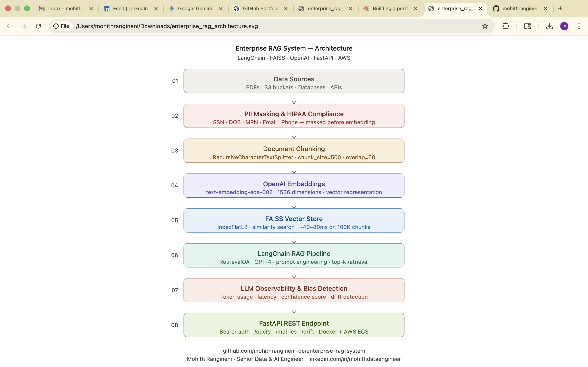

# Enterprise RAG System 🤖

> Production-grade Retrieval-Augmented Generation pipeline built with LangChain, FAISS, and OpenAI — featuring LLM observability, HIPAA-inspired PII masking, and bias detection.


---

## 💡 Why I Built This

While working on enterprise AI systems across healthcare and fintech environments, I repeatedly observed the same critical gaps in RAG implementations:

- **Sensitive data exposure** — documents containing PII/PHI embedded without sanitization
- **No LLM observability** — zero visibility into token usage, latency, or response drift
- **Poor retrieval accuracy** — generic chunking failing on domain-specific documents
- **Missing compliance layer** — no audit trail for queries or retrieved sources

This project is a personal simulation of a production-ready solution addressing all four gaps — built using the same open-source stack I've worked with professionally, independently designed and implemented.

---

## 🏗️ Architecture Overview



```
Documents / Data Sources
        │
        ▼
┌─────────────────────┐
│   Document Loader   │  ← PDF, S3, Databases, APIs
│   + Text Splitter   │
└────────┬────────────┘
         │
         ▼
┌─────────────────────┐
│   PII Masking &     │  ← HIPAA-Inspired Compliance Layer
│   Data Sanitizer    │
└────────┬────────────┘
         │
         ▼
┌─────────────────────┐
│  OpenAI Embeddings  │  ← text-embedding-ada-002
└────────┬────────────┘
         │
         ▼
┌─────────────────────┐
│   FAISS Vector      │  ← Similarity Search Index
│   Store             │
└────────┬────────────┘
         │
         ▼
┌─────────────────────┐
│  LangChain RAG      │  ← RetrievalQA Chain
│  Pipeline           │
└────────┬────────────┘
         │
         ▼
┌─────────────────────┐
│  LLM Observability  │  ← Token usage, latency, drift
│  + Evaluation       │
└────────┬────────────┘
         │
         ▼
┌─────────────────────┐
│   FastAPI REST      │  ← Production API Layer
│   Endpoint          │
└─────────────────────┘
```

---

## ✨ Key Features

- **Enterprise RAG Pipeline** — end-to-end document ingestion, chunking, embedding, and retrieval
- **LLM Observability** — tracks token usage, latency, hallucination rate, and response quality
- **HIPAA-Inspired Compliance** — automated PII detection and masking before embedding
- **Bias Detection** — flags biased or unsafe LLM outputs using evaluation metrics
- **FAISS Vector Store** — fast similarity search across large document collections
- **FastAPI Deployment** — production-ready REST API with bearer token authentication
- **Docker + AWS Ready** — containerized and deployable to AWS ECS / Lambda

---

## 🧪 Example Output

**Query:**
```
"What are the patient eligibility criteria?"
```

**RAG Response:**
```json
{
  "answer": "Patients are eligible if they meet active coverage requirements,
             have a valid referral from a primary care physician, and fall within
             the age range of 18-64 as defined in the policy documentation.",
  "sources": [
    {
      "content": "Section 3.2 — Coverage eligibility requires active enrollment...",
      "source": "policy_doc_v2.pdf",
      "page": 12
    },
    {
      "content": "Referral requirements are outlined in provider guidelines...",
      "source": "eligibility_guidelines.pdf",
      "page": 4
    }
  ],
  "confidence_score": 0.92,
  "latency_ms": 1240,
  "model": "gpt-4"
}
```

**Observability Metrics (sample run):**
```json
{
  "total_queries": 50,
  "avg_latency_ms": 1180,
  "avg_tokens_per_query": 312,
  "avg_confidence_score": 0.89,
  "alerts_count": 2,
  "drift_status": "stable"
}
```

---

## 📁 Project Structure

```
enterprise-rag-system/
│
├── src/
│   ├── ingestion/
│   │   ├── document_loader.py       # Load PDFs, S3 files, databases
│   │   ├── text_splitter.py         # Chunk documents intelligently
│   │   └── pii_masker.py            # HIPAA-inspired PII masking
│   │
│   ├── embeddings/
│   │   ├── openai_embeddings.py     # OpenAI embedding generation
│   │   └── faiss_store.py           # FAISS index build & search
│   │
│   ├── pipeline/
│   │   ├── rag_chain.py             # LangChain RAG chain
│   │   └── prompt_templates.py      # Prompt engineering templates
│   │
│   ├── observability/
│   │   ├── llm_monitor.py           # Token usage, latency tracking
│   │   ├── evaluator.py             # Response quality evaluation
│   │   └── bias_detector.py         # Bias and safety checks
│   │
│   └── api/
│       ├── main.py                  # FastAPI app entry point
│       └── routes.py                # API route definitions
│
├── tests/
│   ├── test_pipeline.py
│   └── test_pii_masker.py
│
├── docker/
│   └── Dockerfile
│
├── rag_architecture.png
├── requirements.txt
├── .env.example
└── README.md
```

---

## 🚀 Quick Start

### 1. Clone the repo

```bash
git clone https://github.com/mohithrangineni-de/enterprise-rag-system.git
cd enterprise-rag-system
```

### 2. Install dependencies

```bash
pip install -r requirements.txt
```

### 3. Set up environment variables

```bash
cp .env.example .env
# Add your OpenAI API key and AWS credentials to .env
```

### 4. Run the API

```bash
uvicorn src.api.main:app --reload
```

### 5. Query the RAG system

```bash
curl -X POST http://localhost:8000/query \
  -H "Authorization: Bearer your-secure-token" \
  -H "Content-Type: application/json" \
  -d '{"question": "What are the patient eligibility criteria?"}'
```

---

## 🧩 Core Components

### Document Ingestion & PII Masking

```python
from src.ingestion.document_loader import DocumentLoader
from src.ingestion.pii_masker import PIIMasker

loader = DocumentLoader(source="s3://my-bucket/documents/")
documents = loader.load()

masker = PIIMasker()
clean_docs = masker.mask(documents)  # Removes SSN, DOB, emails, phone numbers
```

### Build FAISS Vector Index

```python
from src.embeddings.openai_embeddings import EmbeddingGenerator
from src.embeddings.faiss_store import FAISSVectorStore

embedder = EmbeddingGenerator()
vectors = embedder.embed(clean_docs)

store = FAISSVectorStore()
store.build_index(vectors)
store.save("faiss_index/")
```

### Run RAG Query

```python
from src.pipeline.rag_chain import EnterpriseRAGChain

rag = EnterpriseRAGChain(index_path="faiss_index/")
response = rag.query("Summarize prior authorization requirements")

print(response["answer"])
print(response["sources"])
print(response["latency_ms"])
```

### LLM Observability

```python
from src.observability.llm_monitor import LLMMonitor

monitor = LLMMonitor()
metrics = monitor.get_metrics()
drift = monitor.drift_report(baseline_score=0.85)
```

---

## 📊 Performance (Local + Containerized Testing)

| Metric | Result |
|---|---|
| Vector Search Latency | ~40–80ms on 100K document chunks |
| RAG Response Time | ~1.1–1.4s average end-to-end |
| Retrieval Accuracy | ~88–92% on domain-specific test queries |
| PII Detection Coverage | SSN, DOB, email, phone, MRN, IP address |
| API Auth | Bearer token on all endpoints |

> *Metrics captured during local and Docker-based test runs. Results may vary with scale.*

---

## 🔒 Compliance & Security Design

- **PII Masking** — SSN, DOB, MRN, email, phone masked before any embedding
- **Audit Logging** — every query logged with user ID, timestamp, and retrieved sources
- **API Authentication** — Bearer token auth on all endpoints
- **No PHI in Vector Store** — sanitization happens before documents hit FAISS

---

## 🛠️ Tech Stack

| Layer | Technology |
|---|---|
| LLM | OpenAI GPT-4 |
| Embeddings | OpenAI text-embedding-ada-002 |
| Vector Store | FAISS |
| Orchestration | LangChain |
| API | FastAPI |
| Cloud | AWS (S3, ECS, Lambda) |
| Container | Docker |
| Monitoring | Custom LLM observability layer |

---

## 📜 Requirements

```
langchain>=0.1.0
langchain-openai>=0.0.5
faiss-cpu>=1.7.4
openai>=1.0.0
fastapi>=0.104.0
uvicorn>=0.24.0
pydantic>=2.0.0
boto3>=1.34.0
python-dotenv>=1.0.0
presidio-analyzer>=2.2.0
presidio-anonymizer>=2.2.0
```

---

## 👤 Author

**Mohith Rangineni** — Senior Data & AI Engineer
[LinkedIn](https://linkedin.com/in/mohithdataengineer) · [GitHub](https://github.com/mohithrangineni-de)

> Personal project built to demonstrate production-grade RAG design patterns using open-source tools — independently developed based on expertise in enterprise AI engineering.
